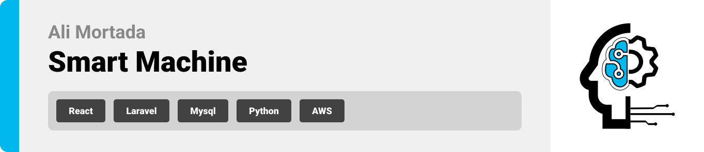
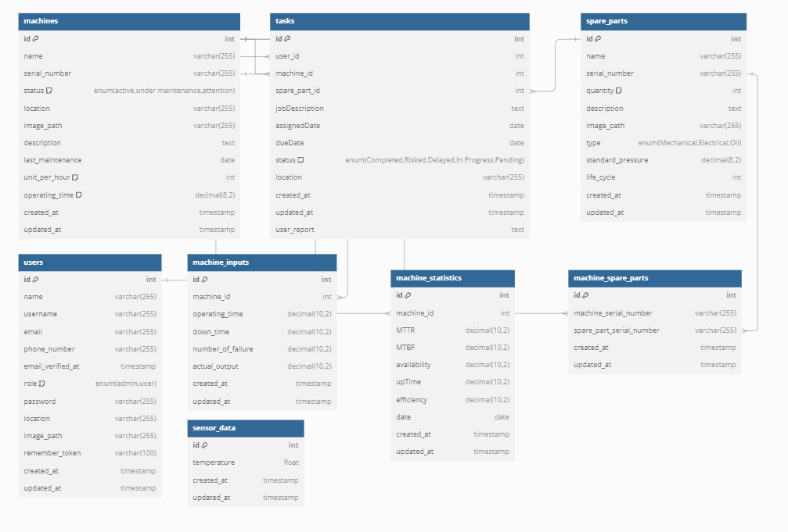
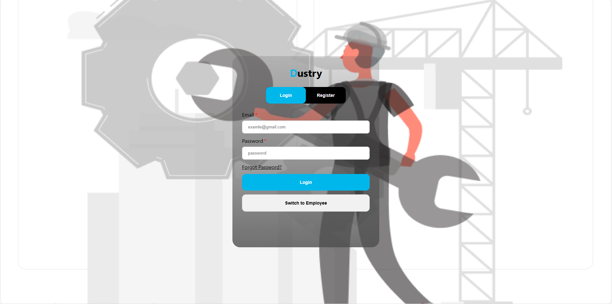
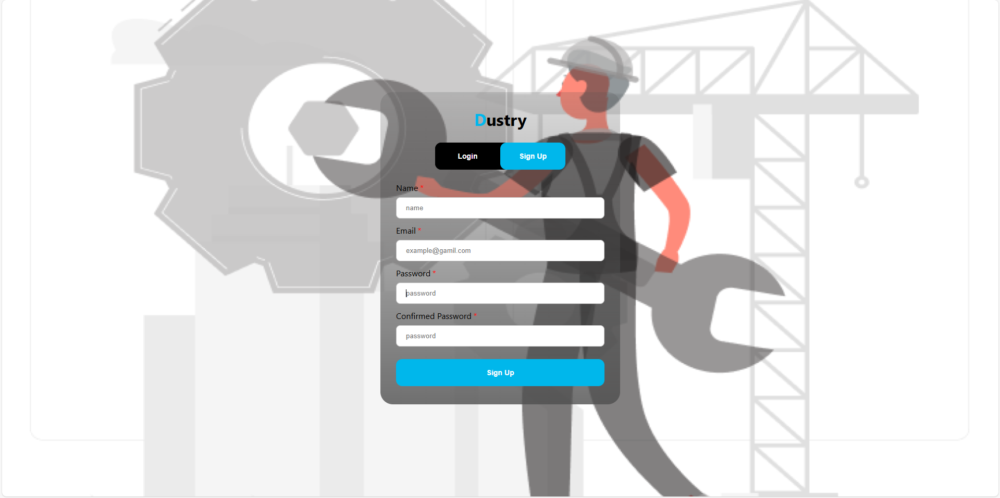
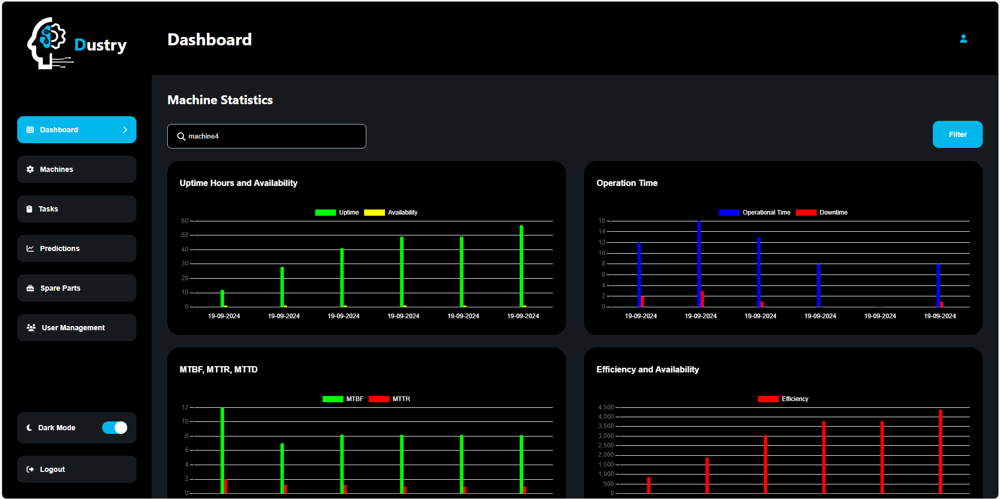
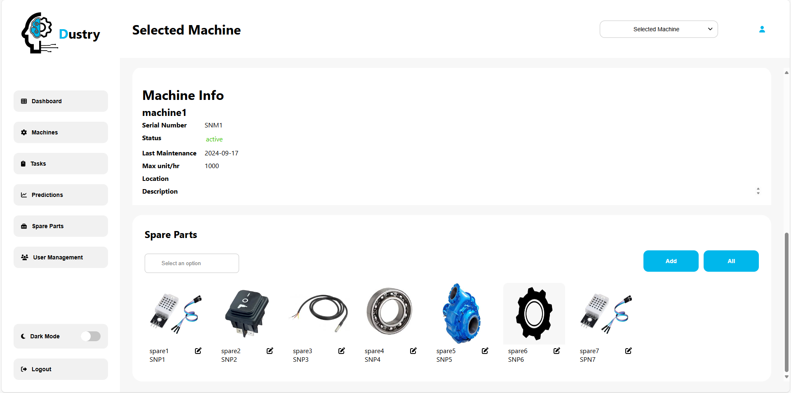
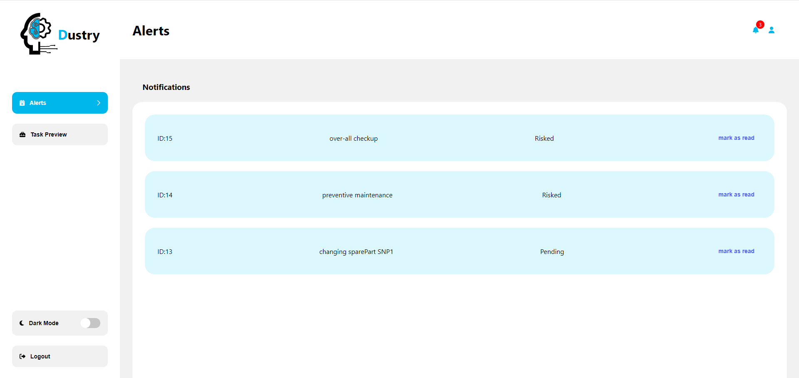
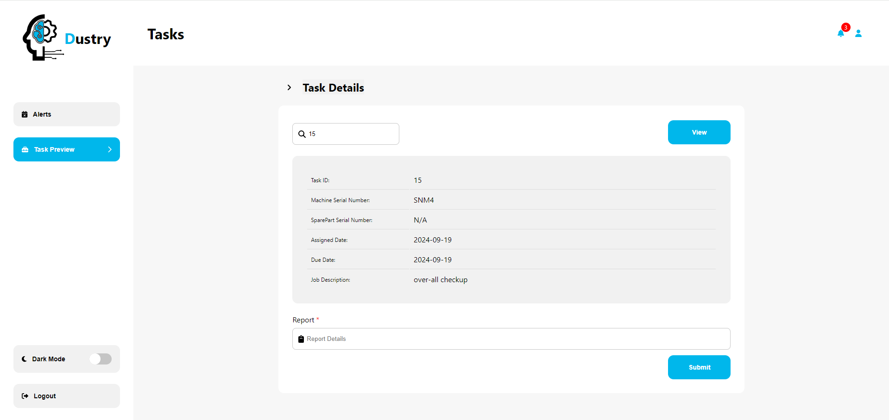

<br><br>

<!-- project philosophy -->


> Industrial Machine Management and Predictive Maintenance System is designed to optimize machine performance and reduce downtime by leveraging advanced data analytics and machine learning, providing actionable AI-driven insights to enhance machine uptime and operational efficiency through proactive maintenance and reduced unexpected failures.

### User Stories

#### Manager

- As a manager, I want to access a dashboard that displays comprehensive information on machine health.
- As a manager, I want to view upcoming maintenance schedules on the dashboard.
- As a manager, I want to review historical data on machine performance and maintenance.

#### User

- As a user, I want to get alerts about upcoming maintenance to avoid disruptions.
- As a user, I want to view machine performance data to spot issues early.
- As a user, I want to check the maintenance schedule to plan my work around downtime.

<br><br>

<!-- Tech stack -->


### Smart Machine Controller is built using the following technologies:

- This project uses the [React](https://reactjs.org/) library. React is a popular JavaScript library for building dynamic and interactive user interfaces, ensuring seamless user experience across web applications.
- For backend services, the app is powered by [Laravel](https://laravel.com/), a PHP framework known for its elegant syntax and ability to handle business logic and APIs with ease.
- To store persistent data (database), the app utilizes [MySQL](https://www.mysql.com/), which allows storing machine statistics, user information, tasks, and notifications in a relational database.
- **Real-Time Task Notification System**: The app uses [Laravel Notifications](https://laravel.com/docs/9.x/notifications) to send real-time notifications when a task is assigned or updated. This includes:
  - **Database Notifications**: Notifications are stored in the database, allowing users to view past notifications.
- Machine statistics like MTTR, MTBF, and machine availability are calculated using background processes in Laravel's job queues.
- The app employs [Python](https://www.python.org/) along with machine learning libraries such as [Scikit-learn](https://scikit-learn.org/) to predict machine failures and estimate the life cycle of spare parts based on historical data.
- **IoT Integration**: The IoT system, using [ESP](https://www.espressif.com/en/products/socs/esp8266) and [Arduino](https://www.arduino.cc/), reads data from temperature sensors and stores it in the database for further analysis, enabling real-time monitoring of environmental conditions without directly connecting to the machines.

<br><br>

<!-- Database Design -->


### Architecting Data Excellence: Innovative Database Design Strategies:


<br><br>

<!-- Implementation -->


### Admin Screens (Web)

| Login Screen                                                                                                  | Register Screen                                  |
| ------------------------------------------------------------------------------------------------------------- | ------------------------------------------------ |
|                                                                    |      |
| Dashboard Screen                                                                                              | Dark Mode                                        |
| <video width="250" autoplay loop muted><source src="./readme/assets/statistics.mp4" type="video/mp4"></video> |           |
| Prediction                                                                                                    | Selected Machine                                 |
| <video width="250" autoplay loop muted><source src="./readme/assets/preditions.mp4" type="video/mp4"></video> |  |

<br><br>

### User Screens (Web)

| Alet Screen                                      | Task Preview Screen                             |
| ------------------------------------------------ | ----------------------------------------------- |
|  |  |

<br><br>

<!-- Prompt Engineering -->


### Mastering AI Interaction: Unveiling the Power of Prompt Engineering:

- This project uses advanced prompt engineering techniques to optimize the interaction with natural language processing models. By skillfully crafting input instructions, we tailor the behavior of the models to achieve precise and efficient language understanding and generation for various tasks and preferences.

<br><br>

<!-- AWS Deployment -->


### Efficient AI Deployment: Unleashing the Potential with AWS Integration:

- This project leverages AWS deployment strategies to seamlessly integrate and deploy natural language processing models. With a focus on scalability, reliability, and performance, we ensure that AI applications powered by these models deliver robust and responsive solutions for diverse use cases.

<br><br>

<!-- Unit Testing -->


### Precision in Development: Harnessing the Power of Unit Testing:

- This project employs rigorous unit testing methodologies to ensure the reliability and accuracy of code components. By systematically evaluating individual units of the software, we guarantee a robust foundation, identifying and addressing potential issues early in the development process.

<br><br>

<!-- How to run -->


> To set up machine controller locally, follow these steps:

### Prerequisites

Before setting up the project, ensure you have the following installed on your machine:

1. npm
   If you need to update npm to the latest version:

```sh
npm install npm@latest -g
```

2. PHP and Composer:
   -Download PHP from[here](https://www.php.net/downloads)
   -Composer Installation:
   Follow the installation guide on(getcomposer.org)

3. MySQL Database:
   Download MySQL from the(https://dev.mysql.com/downloads/installer/)

4. Python:
   Download and install Python from (https://www.python.org/downloads/)

5. Arduino IDE:
   Download the Arduino IDE from (https://www.arduino.cc/en/software)

### Installation

_Below is an example of how you can instruct your audience on installing and setting up your app. This template doesn't rely on any external dependencies or services._

1. Clone the repo
   git clone [github](https://github.com/AliM-1997/machine-controller)
2. Navigate to the project directory

```sh
cd machine-controller

```

3. Frontend Setup (React): Navigate to the frontend directory and install the required npm packages and run.

```sh
cd front
npm install
npm start
```

4. Backend Setup (Laravel): Navigate to the backend directory and install the required Composer packages and run.

```sh
cd back
composer install
php artisan serve --host=0.0.0.0 --port=8000
```

5. Install the Python packages using requirements.txt for machine learning and run:

```sh
cd prediction
pip install -r requirements.txt
python -m app.main.py
```

Now, you should be able to run machine controller locally and explore its features.
